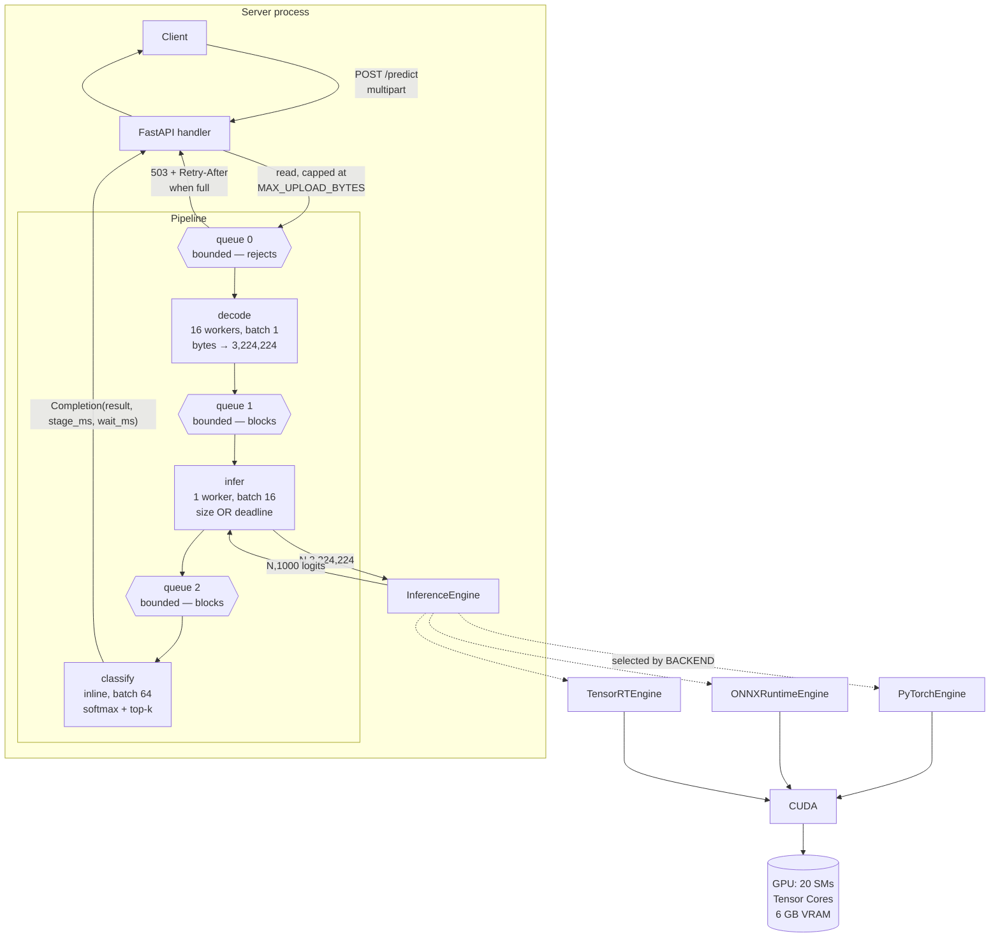
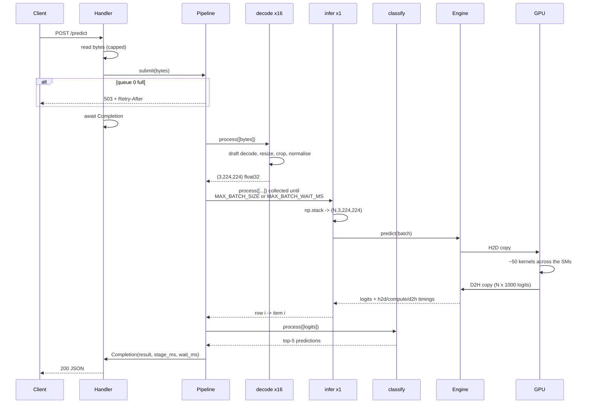
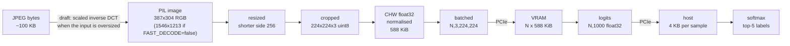
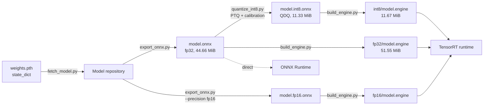
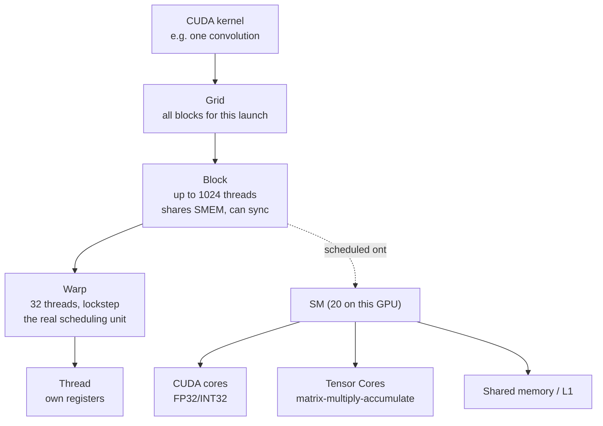
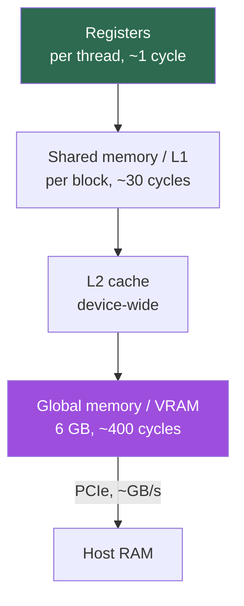
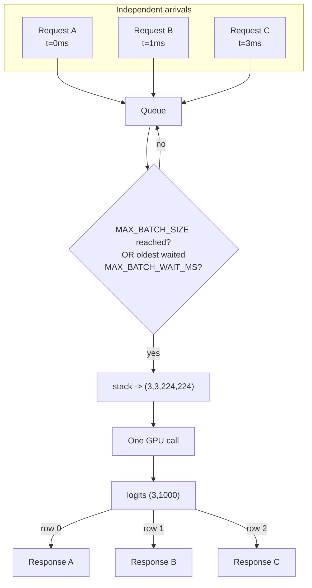
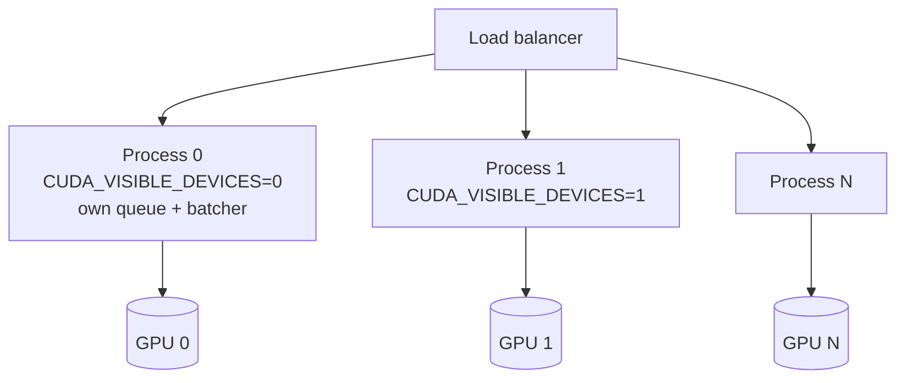

# Architecture

Every diagram here describes code that exists. Nothing is aspirational.

## System

Each stage has its own bounded queue. **Queue 0 rejects; the rest block** — a
full downstream queue stalls the upstream worker, and the stall propagates back
to queue 0 where it becomes a 503. Dropping a request that has already been
decoded would throw away the most expensive work the system does.

The three stages differ only in how they are *run*, and each setting is a
measurement:

| stage | workers | batch | why |
|---|---|---|---|
| decode | 16 | 1 | CPU-bound and PIL releases the GIL, so threads scale. No per-call fixed cost, so batching would buy nothing. |
| infer | 1 | 16 | One CUDA context serialises anyway. Per-*call* fixed costs (launches, H2D, the Python/CUDA boundary) are what a batch amortises. |
| classify | 0 (inline) | 64 | 0.09 ms of numpy. A thread hop would cost more than the work. |

See [pipeline.md](pipeline.md) for the runtime itself.

## Request lifecycle

`predict()` runs in the infer stage's thread, not on the event loop: it
synchronises on CUDA, and running it inline would stall every other request —
health checks, new arrivals, metrics — for the whole forward pass.

## Tensor lifecycle

One sample is `3 × 224 × 224 = 150,528` elements × 4 bytes = **588 KiB**. At
batch 32 that is 18 MiB crossing PCIe — small enough that Phase 4 found the
transfer irrelevant next to a 214 MiB activation peak.

## Model conversion pipeline

Building is separate from serving because it takes 10–100 s of tactic timing on
*this* GPU. Engines are gitignored: they are build artifacts tied to the
architecture, TensorRT version and driver, not models.

## GPU execution hierarchy

A block is assigned to one SM and never migrates. Warps are what the SM
actually schedules; a branch that diverges within a warp costs both paths.
Occupancy — resident warps per SM — is what hides memory latency.

## Memory hierarchy

The cliff between VRAM and host is why the whole design keeps data on the
device once it arrives, and why the CUDA context costs 104.81 MiB before a
single tensor exists (Experiment 4).

## Dynamic batching

The deadline is started by the **first** request in the batch and never reset —
otherwise a steady trickle postpones dispatch indefinitely.

Row-to-request mapping is the one place a bug produces confident wrong answers
for everyone with nothing raised. It is now a single `zip(..., strict=True)`
inside the pipeline runner rather than hand-written per batching implementation;
`tests/test_pipeline.py::test_result_i_goes_to_job_i` checks it with per-request
markers, and `tests/test_stages.py` checks the engine's own row split.

In practice this system rarely fills a batch: a 900-request run averaged **2.3
images per GPU call** against a `MAX_BATCH_SIZE` of 16, because decode cannot
feed the GPU fast enough to reach the size trigger before the deadline.

## Multi-GPU scaling

**Not implemented** — this machine has one GPU. The shape is replication, not
sharding: ResNet-18 is 45 MB and fits many times over, so every GPU gets a full
copy and requests are load-balanced across processes. Sharding a model across
GPUs is for models that do not fit on one, and it costs inter-GPU
synchronisation on every forward pass.

One process per GPU rather than threads: a single CUDA context serialises
anyway, and separate processes sidestep the GIL entirely.
