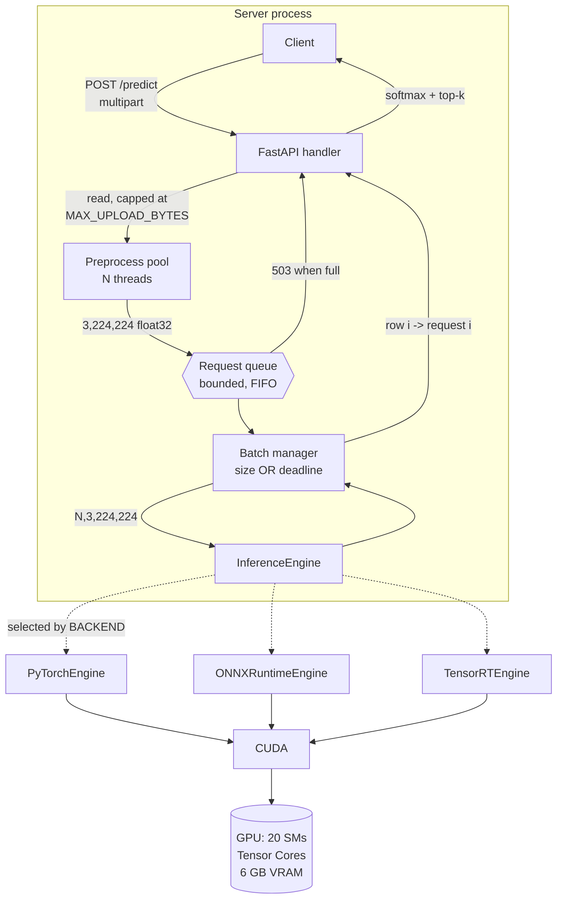
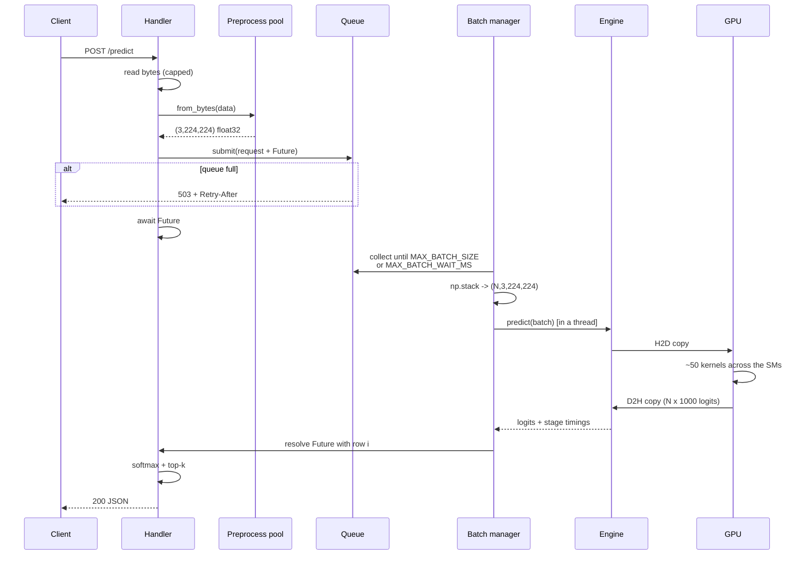
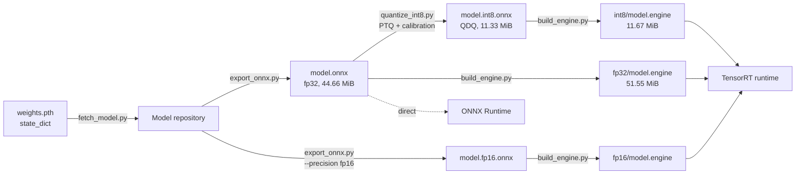
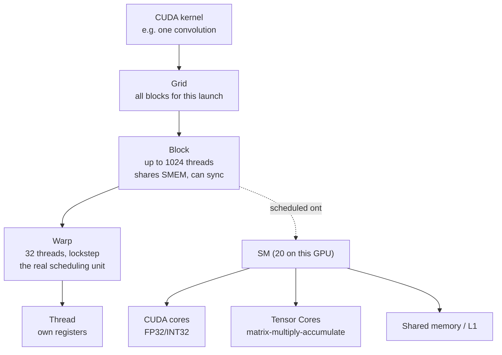
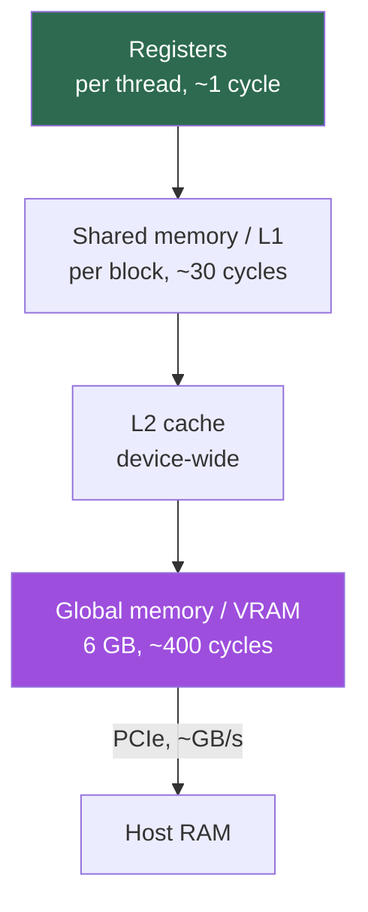
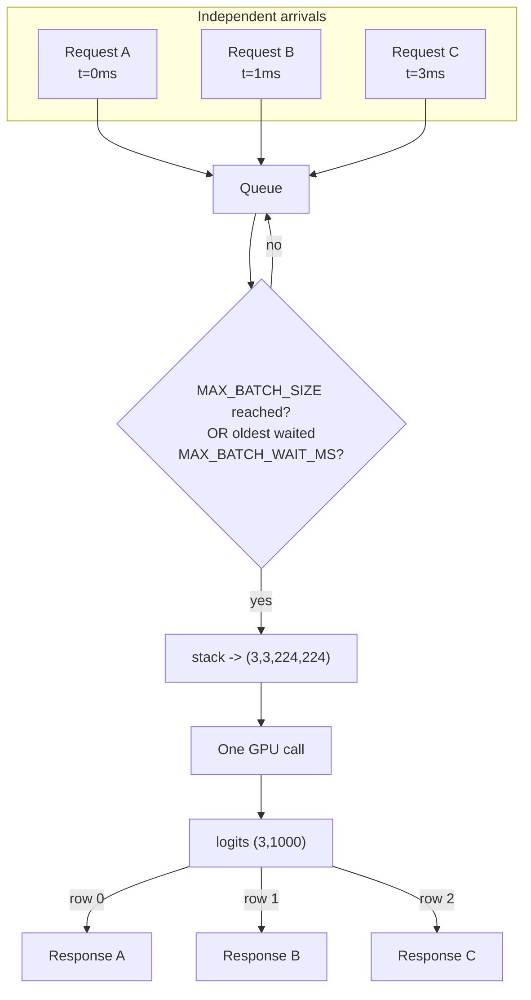
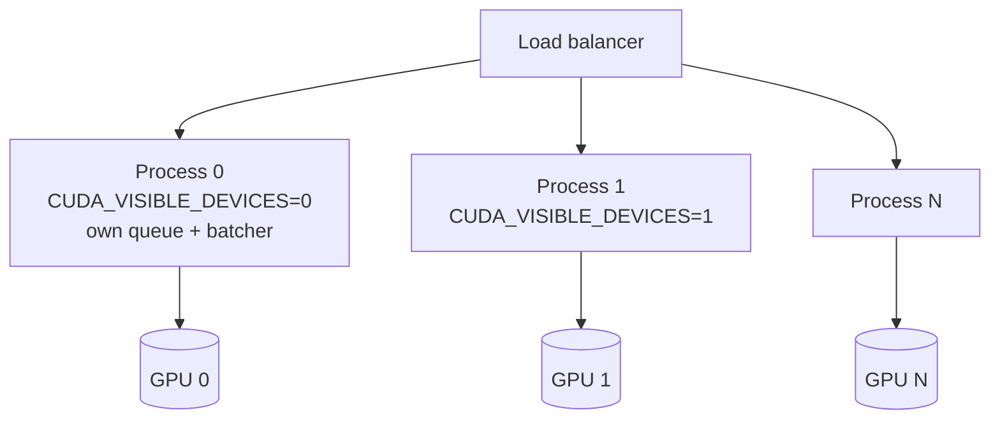

# Architecture

Every diagram here describes code that exists. Nothing is aspirational.

## System

Preprocessing sits **before** the queue on purpose. Phase 4 measured one
preprocessing thread sustaining ~46 img/s against an engine that absorbs
700–3200; putting it inside the batch worker would serialise the slowest stage.

## Request lifecycle

## Tensor lifecycle

One sample is `3 × 224 × 224 = 150,528` elements × 4 bytes = **588 KiB**. At
batch 32 that is 18 MiB crossing PCIe — small enough that Phase 4 found the
transfer irrelevant next to a 214 MiB activation peak.

## Model conversion pipeline

Building is separate from serving because it takes 10–100 s of tactic timing on
*this* GPU. Engines are gitignored: they are build artifacts tied to the
architecture, TensorRT version and driver, not models.

## GPU execution hierarchy

A block is assigned to one SM and never migrates. Warps are what the SM
actually schedules; a branch that diverges within a warp costs both paths.
Occupancy — resident warps per SM — is what hides memory latency.

## Memory hierarchy

The cliff between VRAM and host is why the whole design keeps data on the
device once it arrives, and why the CUDA context costs 104.81 MiB before a
single tensor exists (Experiment 4).

## Dynamic batching

The deadline is started by the **first** request in the batch and never reset —
otherwise a steady trickle postpones dispatch indefinitely. Row-to-request
mapping is the one place a bug produces confident wrong answers for everyone
with nothing raised; `tests/test_batching.py` checks it with per-request markers.

## Multi-GPU scaling

**Not implemented** — this machine has one GPU. The shape is replication, not
sharding: ResNet-18 is 45 MB and fits many times over, so every GPU gets a full
copy and requests are load-balanced across processes. Sharding a model across
GPUs is for models that do not fit on one, and it costs inter-GPU
synchronisation on every forward pass.

One process per GPU rather than threads: a single CUDA context serialises
anyway, and separate processes sidestep the GIL entirely.
